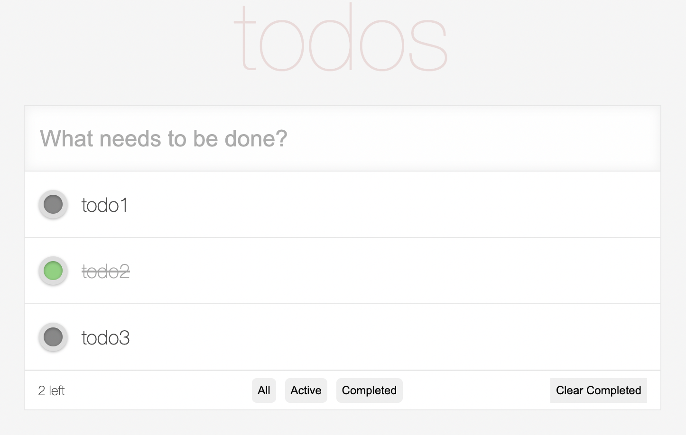

# Web Programming 2021

## HW4 ([Task description](./hw4.pdf))



## Run in local

1. Clone the repository and install the required packages:

   ```bash
   git clone https://github.com/b06608062/NTU-2021-Web-Programming-todo-list-react.git
   cd ./NTU-2021-Web-Programming-todo-list-react
   nvm use 16
   npm install
   npm run start
   ```

2. Open [http://localhost:3000](http://localhost:3000) in your browser to view the application.
